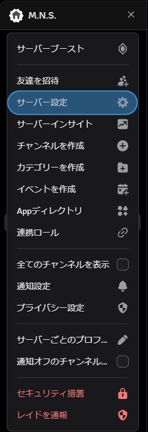

# HookMaster for Discord
## _Webhookは難しくない。簡単をすべての方に..._
### DiscordのWebhookを自由自在に操作できるCUIアプリ
HookMaster for Discord(略称:HMD)は**とても簡単に**Discordのウェブフックを自由自在に操れるCUIベースのアプリです。  
### 主な機能
- ✅ 複数のWebhookを管理！
- 🚀 簡単なコマンド操作で即送信！
- 🛠️ Webhookの履歴を自動保存！
- 🔧 データはjsonで管理するので扱いやすい！  
### 必要条件  
- Java21 ([DL](https://www.oracle.com/jp/java/technologies/downloads/#jdk21-windows))  
起動には以上の条件を満たしている必要があります。
### 簡単な説明
```shell
===== Discord Webhook CUI =====
1. Webhookを登録
2. メッセージを送信
3. 履歴を表示
4. Webhookの名前を変更
5. 終了
```
起動時のホーム画面です。  
`選択番号:`  
ここに1~5を入力しましょう。  
> 1. [Webhookを登録](#機能1----webhookを登録)
> 2. [メッセージを送信](#機能2----メッセージを送信)
> 3. [履歴を表示](#機能3----履歴を表示)
> 4. [Webhookの名前を変更](#機能4----webhookの名前を変更)
> 5. [終了](#機能5----終了)

## (機能1)    Webhookを登録
コマンドを実行すると、  
`Webhook名:`  
というものが表示されます。これは実際にDiscord送信時に使用される名前でもありますので、真剣に考えましょう。  
この後説明する[Webhookの名前を変更](#機能4----webhookの名前を変更)という場所でも変更することができます。  
次に、名前の設定が完了すると  
`Webhook URL:`  
というものが出できます。ここにはWebhookのURLを指定しましょう。  
WebhookのURLの取得方法がわからない場合は[こちら](#おまけ----webhookの作り方)を参照。
## (機能2)    メッセージを送信
いつか説明します。
## (機能3)    履歴を表示
上に同じく
## (機能4)    Webhookの名前を変更
上に同じく
## (機能5)    終了
CUIを閉じます。

## (おまけ)    Webhookの作り方
  
サーバー設定をクリック  
  
連携サービスをクリック  
  
ウェブフックをクリック  
  
新規ウェブフックが自動で作成されるのでそれをクリックし、`ウェブフックURLをコピー`を押してコピー完了！